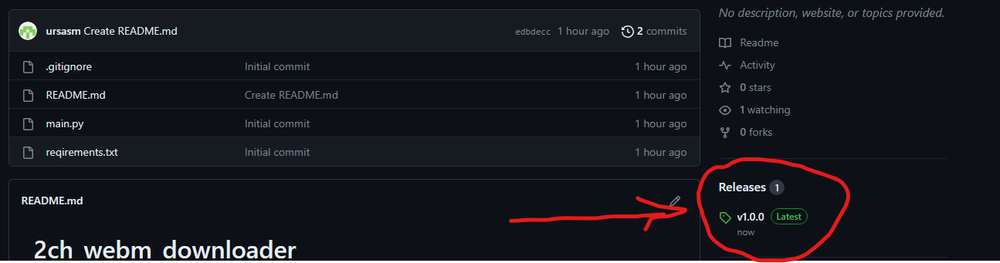

# 2ch_webm_downloader
Небольшой скрипт для загрузки всех видео и изображений из треда

Для Windows можно скачать исполняемый файл из релизов


Или запустить исходный код. Для запуска выполнить в терминале:
```shell
git clone https://github.com/ursasm/2ch_webm_downloader
python -m venv venv

# Для Windows
venv\Scripts\pip install -r reqirements.txt
venv\Scripts\python main.py 

# Для Linux
venv/bin/pip install -r reqirements.txt
venv/bin/python main.py 

```

Необходимо будет ввести URL треда и нажать ENTER.\
Файлы будут загружены в папку рядом с исполняемым файлом

